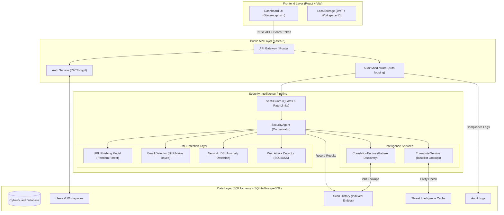

# System Architecture

The CyberGuard AI SaaS Platform utilizes a multi-layered security architecture designed for high-performance threat detection, intelligence correlation, and enterprise-grade auditing.

## Architecture Overview

## Component Breakdown

### 1. Frontend Layer
- **Dashboard UI**: A premium React-based interface using modern CSS (Glassmorphism) and Lucide icons.
- **Session Management**: Uses JWT stored in local storage and workspace context to ensure multi-tenant isolation.

### 2. Security Intelligence Pipeline
- **SaaSGuard**: Enforces business logic (monthly quotas) and platform stability (rate limiting).
- **SecurityAgent**: The central orchestrator that manages the flow of a scan request.
- **ThreatIntelService**: Performs sub-millisecond lookups against blacklisted domains and IPs with TTL-based caching.
- **CorrelationEngine**: Discovers relationships across different vectors (e.g., if a URL in an email matches a previously scanned network entity) and adjusts risk scores dynamically.

### 3. ML Detection Layer
- **Vector-Specific Models**: Dedicated machine learning models for different threat surfaces. Each model provides a confidence score and severity label which is then normalized by the `ScoringEngine`.

### 4. Data Layer
- **Multi-Tenant Isolation**: Every record is tied to a `workspace_id`.
- **Indexed Entities**: The `entity` column in scan history is indexed to enable rapid cross-vector correlation across thousands of historical events.
