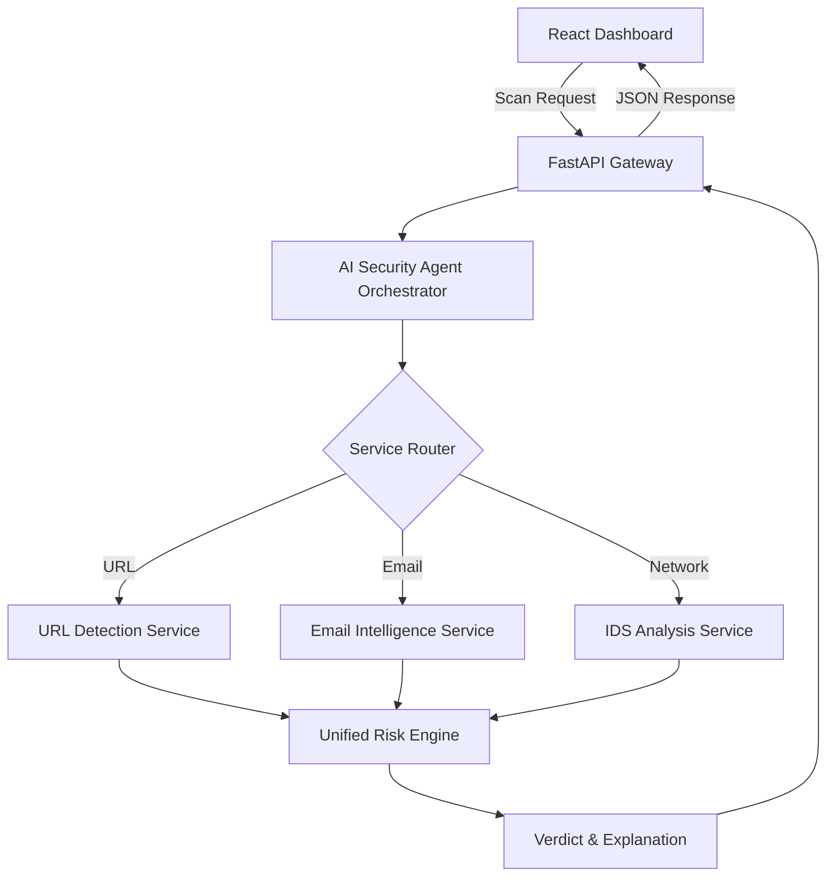

# CyberGuard AI - Project Documentation

## 🛡️ Project Overview
**CyberGuard AI** is an AI-Agent based Cybersecurity Threat Detection platform. It utilizes multiple Machine Learning models orchestrated by an intelligent Security Agent to detect threats across various vectors including Phishing URLs, Malicious Emails, and Network Intrusions.

---

## 🏗️ System Architecture

### 1. High-Level Workflow


### 2. Core Components
- **Frontend**: React.js + Vite (Modern, responsive dark-themed dashboard).
- **Backend API**: FastAPI (Python-based, high-performance asynchronous API).
- **Orchestration Layer**: `SecurityAgent` (Handles task routing and parallel model execution).
- **ML Models**: Scikit-learn models (`RandomForest`, `LogisticRegression`, `TF-IDF Vectorizers`) for phishing and intrusion detection.

---

## 📁 Project Structure

```text
Final_Year_Project/
├── api.py                  # API Gateway (FastAPI)
├── src/
│   ├── agent/              # AI Orchestration (SecurityAgent)
│   ├── services/           # Service Layer (Business Logic)
│   ├── utils/              # Scoring Engine & Utilities
│   └── detectors/          # ML Model wrappers & Feature extractors
├── models/                 # Saved .pkl Machine Learning models
├── datasets/               # Training datasets
├── dashboard/              # React + Vite Frontend
│   ├── src/
│   │   ├── components/     # Reusable UI parts (Scanners, Sidebar)
│   │   ├── pages/          # Full page views
│   │   └── config/         # API configuration
└── PROJECT_DOCUMENTATION.md # You are here
```

---

## 🔬 Intelligence & Scoring

### AI Security Agent
The agent is the "brain" of the system. It receives inputs and automatically decides which specialized models to trigger. It utilizes `asyncio` to run multiple scans in parallel, ensuring low latency.

### Unified Risk Scoring (0–100)
The **Scoring Engine** calculates a final risk score using a weighted max-biased approach:
- **0–30 (Low)**: Safe / Legitimate.
- **31–60 (Medium)**: Suspicious, review recommended.
- **61–85 (High)**: Threat detected, warning issued.
- **86–100 (Critical)**: Immediate action required.

**Risk Formula**: `max(model_confidence) * Severity_Weight` for the dominant threat.

---

## 🚀 API Reference

### Unified Analyze Endpoint
`POST /api/v1/agent/analyze`

**Request Body:**
```json
{
  "type": "auto", 
  "data": "suspicious-link.com",
  "metadata": { "workspace_id": "team-alpha" }
}
```

**Response Body:**
```json
{
  "agent_verdict": {
    "score": 85.0,
    "label": "HIGH",
    "summary": "Phishing indicator detected in URL structure."
  },
  "vector_details": [...],
  "status": "completed"
}
```

---

## 🛠️ Setup & Execution

### Prerequisites
- Python 3.10+
- Node.js & npm

### Backend Setup
1. `pip install fastapi uvicorn scikit-learn pandas joblib`
2. `python api.py`

### Frontend Setup
1. `cd dashboard`
2. `npm install`
3. `npm run dev`

---

## 👥 Team & Development
- **Phase**: Implementation (Orchestration Layer Complete)
- **Status**: Backend V2.0 (Agent-Based)
- **Next Milestone**: Real-time visualization & SaaS Monitoring.

*(This file is automatically updated as the project evolves.)*
