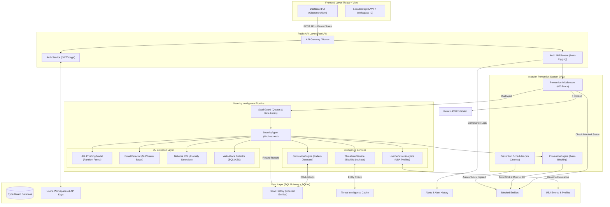

# 🛡️ CyberGuard AI - Complete System Manual & Reference Guide

Welcome to the official developer manual and reference guide for **CyberGuard AI**, an enterprise-ready Multi-Vector Threat Detection and Intrusion Prevention SaaS platform. This document serves as the single source of truth for the system's architecture, database models, ML models, service layer, and frontend components.

---

## 🏗️ 1. High-Level Architecture & Request Flow

CyberGuard AI uses an asynchronous, multi-layered security pipeline. Incoming scan requests or network/web events pass through safety checks, machine learning classifiers, local threat feeds, and correlation checks before generating alerts or triggering automated prevention rules.



---

## 🗄️ 2. Database Schema Reference (SQLAlchemy Models)

The system relies on 11 core tables mapped via SQLAlchemy. All tenant operations are isolated via `workspace_id`.

### 2.1 Workspace
Represents an organization or tenant on the platform.
*   `id` (UUID, PK): Unique identifier.
*   `name` (String): Workspace name.
*   `tier` (String): Subscription tier (`free`, `pro`, `enterprise`).
*   `monthly_quota` (Integer): Max scans allowed per month.
*   `rate_limit_rpm` (Integer): Allowed requests per minute.
*   `created_at` (DateTime): Record creation timestamp.

### 2.2 User
User account associated with a specific workspace.
*   `id` (UUID, PK): Unique identifier.
*   `workspace_id` (UUID, FK -> `workspaces.id`): Tenant isolation.
*   `email` (String, Unique, Index): Contact email.
*   `hashed_password` (String): Secure bcrypt password.
*   `full_name` (String): Display name.
*   `role` (String): Access level (`admin`, `developer`, `viewer`).
*   `is_active` (Boolean): Status flag.
*   `created_at` (DateTime): Account creation timestamp.

### 2.3 APIKey
API key credentials for third-party integrations.
*   `id` (UUID, PK): Unique identifier.
*   `workspace_id` (UUID, FK -> `workspaces.id`): Tenant isolation.
*   `key_hash` (String, Unique, Index): SHA-256 hashed API key.
*   `label` (String): Key description.
*   `is_active` (Boolean): Status flag.
*   `created_at` (DateTime): Key creation timestamp.
*   `last_used` (DateTime): Last API request timestamp.

### 2.4 ScanHistory
Records all raw threat scan outcomes.
*   `id` (UUID, PK): Unique identifier.
*   `workspace_id` (UUID, FK -> `workspaces.id`): Tenant isolation.
*   `user_id` (UUID, FK -> `users.id`, Nullable): Responsible user.
*   `input_type` (String): Scan vector (`url`, `email`, `network`, `web`).
*   `entity` (String, Index): Normalized primary target (IP, domain, email sender).
*   `entities` (JSON): List of all sub-entities extracted during analysis.
*   `attack_type` (String, Index): Classification (e.g., `phishing`, `sql_injection`, `network_anomaly`).
*   `severity` (String, Index): Threat level (`LOW`, `MEDIUM`, `HIGH`, `CRITICAL`).
*   `ml_confidence` (Integer): Raw classifier output (0-100).
*   `intelligence_hit` (Boolean): Flag representing ThreatIntel blacklist match.
*   `correlation_hit` (Boolean): Flag representing recent correlated scans.
*   `prevention_triggered` (Boolean): Flag representing active blocking response.
*   `risk_score` (Integer): Final calculated score (0-100).
*   `verdict` (String): Final safety verdict (`SAFE`, `SUSPICIOUS`, `MALICIOUS`).
*   `explanation` (JSON): Threat explanation and evidence summary.
*   `mitre_mappings` (JSON): Array of MITRE ATT&CK techniques.
*   `details` (JSON): Vector-specific technical metadata.
*   `created_at` (DateTime): Scan timestamp.
*   *Indexes*: Composite indexes are placed on `(workspace_id, created_at)`, `(workspace_id, verdict)`, and `(workspace_id, attack_type)`.

### 2.5 AuditLog
Captures platform administrative actions and mutations for security compliance.
*   `id` (UUID, PK): Unique identifier.
*   `workspace_id` (UUID, FK -> `workspaces.id`): Tenant isolation.
*   `user_id` (UUID, FK -> `users.id`, Nullable): Action trigger.
*   `action` (String): Event description (`login_success`, `api_key_created`, `unblock_entity`, etc.).
*   `module` (String): Context area (`auth`, `workspace`, `agent`, `prevention`).
*   `status` (String): Outcome (`success`, `failure`, `warning`).
*   `event_metadata` (JSON): HTTP client IP, user-agent, or specific action payloads.
*   `created_at` (DateTime): Log timestamp.

### 2.6 UserBehaviorProfile
Stores statistical baselines for User Behavior Analytics.
*   `id` (UUID, PK): Unique identifier.
*   `workspace_id` (UUID, FK -> `workspaces.id`): Tenant isolation.
*   `user_id` (UUID, FK -> `users.id`, Nullable): Monitored user.
*   `average_daily_logins` (Integer): Mean logins per day (rolling 30-day baseline).
*   `average_api_calls` (Integer): Mean daily API transactions.
*   `common_ip_addresses` (JSON): Top client IPs.
*   `common_locations` (JSON): Top geographical origins.
*   `common_login_hours` (JSON): Peak hours of activity.
*   `baseline_risk_score` (Integer): Historical average anomaly score.
*   `created_at` (DateTime): Profile creation timestamp.
*   `updated_at` (DateTime): Profile update timestamp.

### 2.7 UserBehaviorEvent
Logs user transactions for anomaly scoring.
*   `id` (UUID, PK): Unique identifier.
*   `workspace_id` (UUID, FK -> `workspaces.id`): Tenant isolation.
*   `user_id` (UUID, FK -> `users.id`, Nullable): Target user.
*   `event_type` (String, Index): Action (`login_success`, `login_failed`, `api_request`, etc.).
*   `ip_address` (String, Index): Origin client IP.
*   `location` (String): Inferred geographic location.
*   `endpoint_accessed` (String): Targeted API route.
*   `timestamp` (DateTime, Index): Time of occurrence.
*   `anomaly_score` (Integer): Score reflecting deviation from baseline (0-100).
*   `risk_level` (String, Index): Classification (`NORMAL`, `SUSPICIOUS`, `HIGH`, `CRITICAL`).
*   `explanation` (JSON): List of anomaly signals, explanations, and remediation steps.

### 2.8 ThreatIntel
Local cached threat intelligence feed.
*   `id` (UUID, PK): Unique identifier.
*   `entity_value` (String, Unique, Index): Malicious IP, URL, or domain name.
*   `entity_type` (String): Indicator type (`domain`, `ip`).
*   `threat_type` (String): Category (`phishing`, `malware`, `botnet`).
*   `risk_level` (String): Rated severity.
*   `source` (String): Threat feed source (`local`, `abuseipdb`, `virustotal`).
*   `last_synced` (DateTime): Last sync time.
*   `is_active` (Boolean): Status flag.

### 2.9 Alert
Security events generated on high-risk detections.
*   `id` (UUID, PK): Unique identifier.
*   `workspace_id` (UUID, FK -> `workspaces.id`): Tenant isolation.
*   `user_id` (UUID, FK -> `users.id`, Nullable): Affected user.
*   `scan_history_id` (UUID, FK -> `scan_history.id`, Nullable): Initiating scan.
*   `alert_type` (String): Incident category (`phishing`, `malware`, `network_anomaly`, `sql_injection`, `xss`).
*   `severity` (String, Index): Calculated classification (`LOW`, `MEDIUM`, `HIGH`, `CRITICAL`).
*   `title` (String): Alert summary header.
*   `description` (String): Explanatory text.
*   `entity` (String, Index): Affected system indicator (IP, URL, Email).
*   `entity_type` (String): Indicator class.
*   `source_vector` (String): Ingestion engine (`URL`, `EMAIL`, `NETWORK`, `WEB`).
*   `risk_score` (Integer): Final calculated risk rating (0-100).
*   `ml_confidence` (Integer): ML classifier model confidence.
*   `indicators` (JSON): Trigger rules details.
*   `correlated_events` (Integer): Event count.
*   `recommended_action` (String): Prescribed playbook remediation.
*   `resolved_status` (Boolean, Index): Current resolution state.
*   `resolved_at` (DateTime): Time of resolution.
*   `resolved_by` (UUID, FK -> `users.id`): Actor that resolved the alert.
*   `resolution_notes` (String): Resolving comments.
*   `notification_sent`/`email_sent`/`webhook_sent` (Boolean): Notification flags.
*   `created_at` (DateTime): Alert generation timestamp.

### 2.10 AlertHistory
Maintains compliance audit trails for security alerts.
*   `id` (UUID, PK): Unique identifier.
*   `alert_id` (UUID, FK -> `alerts.id`): Associated alert.
*   `workspace_id` (UUID, FK -> `workspaces.id`): Tenant isolation.
*   `user_id` (UUID, FK -> `users.id`, Nullable): Operational actor.
*   `action` (String): Action taken (`created`, `resolved`, `escalated`).
*   `previous_severity` (String): Former status.
*   `new_severity` (String): Current status.
*   `notes` (String): Log details.
*   `created_at` (DateTime): Timestamp of action.

### 2.11 BlockedEntity
Represents active blocks enforced by the Intrusion Prevention System.
*   `id` (UUID, PK): Unique identifier.
*   `workspace_id` (UUID, FK -> `workspaces.id`): Tenant isolation.
*   `entity` (String, Index): Targeted IP, URL, or domain.
*   `entity_type` (String): Indicator class (`IP`, `URL`, `DOMAIN`).
*   `severity` (String): Severity level (`LOW`, `MEDIUM`, `HIGH`, `CRITICAL`).
*   `reason` (String): Blocking trigger rule (e.g., `High risk score (>= 90)`).
*   `blocked_until` (DateTime, Index): Block expiration timestamp.
*   `auto_generated` (Boolean): Auto-block vs manual block.
*   `resolved_status` (Boolean, Index): Set to True if entity has been manually unblocked.
*   `prevention_reason` (String): Textual justification.
*   `related_alert_id`/`related_scan_id` (UUID, FK, Nullable): Diagnostic links.
*   `blocked_request_count` (Integer): Traffic requests dropped from this sender.
*   `created_at` (DateTime): Block initiation timestamp.
*   `unblocked_at`/`unblocked_by` (DateTime/UUID): Cleanup trace details.

---

## 🧠 3. Threat Intelligence & ML Classifiers

CyberGuard AI relies on vector-specific threat intelligence services and trained ML models:

1.  **URL Phishing Detection**: A Random Forest model (`models/url_phishing_model.pkl`) evaluates domain length, special characters, and prefix-suffix patterns.
2.  **Network Intrusion (IDS)**: An anomaly detection model (`models/network_ids_model.pkl`) built on NSL-KDD dataset features (`models/network_scaler.pkl` & `models/network_features.pkl`) evaluates incoming traffic structures.
3.  **Email Phishing/Spam**: A text classifier (`models/email_phishing_model.pkl`) utilizes TF-IDF text vectorizers (`models/email_vectorizer.pkl`) to identify malicious keywords and phishing language.
4.  **Web Attack Detection**: An SQLi/XSS classification model (`models/web_attack_model.pkl` & `models/web_attack_features.pkl`) scanning HTTP payloads for traversal, SQL patterns, and script injections.

---

## 🔔 4. Core Security Pipeline Services

### 4.1 Orchestrator (`src/agent/orchestrator.py`)
Routes inputs to the proper model handlers using `asyncio` to process scans in parallel. Normalizes outputs and queries the ThreatIntel and Correlation databases.

### 4.2 Threat Intelligence (`src/services/threat_intel.py`)
Performs lookups against the local `threat_intel` database. Matches strip schemas and check entities against blacklists.

### 4.3 Correlation Engine (`src/services/alert_service.py`)
Queries the last 24 hours of scan histories. If the same entity triggers matches across different vectors (e.g., a URL found in a network block and an email), the risk score is automatically boosted.

### 4.4 Alert & Notification System (`src/services/alert_service.py` & `src/services/notification_service.py`)
Handles alert creation when risk scores exceed 70. Configured with a 60-minute duplicate cooldown window. Dispatches HTML-formatted email alerts via SMTP and pushes JSON alert objects to external webhooks.

### 4.5 Intrusion Prevention System (IPS) (`src/services/prevention_engine.py`)
Converts passive detections into automated action. Auto-blocks entities with risk scores `>= 90` or those matching ThreatIntel databases.

| Severity | Block Duration |
|----------|----------------|
| MEDIUM   | 1 hour         |
| HIGH     | 24 hours       |
| CRITICAL | 7 days         |

The background task scheduler `PreventionScheduler` runs every 5 minutes to release expired blocks.

### 4.6 User Behavior Analytics (`src/services/user_behavior_analytics.py`)
Constructs geographic, IP, and time-based login baselines over 30-day windows. Measures anomalies:
*   **Impossible Travel**: Detects travel speeds over 900 km/h between logins.
*   **Off-Hours login**: Logs authentication attempts outside standard peak hours.
*   **Spikes & Chains**: Evaluates daily API usage spikes or auth failure chains.

### 4.7 Explainability & MITRE Mapping (`src/services/threat_explanation_service.py` & `src/services/mitre_mapping_service.py`)
Translates machine learning classifications into explanations. Mapped technique IDs include:
*   `T1566` / `T1566.002`: Phishing / Spearphishing Link.
*   `T1056`: Input Capture (Credential Harvesting).
*   `T1190`: Exploit Public-Facing Web Application (SQLi/XSS).
*   `T1595` / `T1046`: Active Scanning / Service Discovery (Network scans).
*   `T1110`: Brute Force attacks.

### 4.8 PDF Report Generator (`src/services/pdf_report_service.py`)
A custom, dependency-free PDF layout builder. Renders executive summary assessments containing incident trends, MITRE distributions, and recommendations.

---

## 🎨 5. Frontend UI Map (React + Vite)

The React dashboard utilizes CSS Glassmorphism styling and includes several management panels:

1.  **Dashboard Overview (`DashboardPage.jsx`)**: Displays unified status grids, recent scan timelines, and top blocked IP statistics.
2.  **Threat Prevention Center (`PreventionCenter.jsx`)**: Displays active block lists, unblocking history logs, and manual unblocking tools.
3.  **Alerts Panel (`AlertsPanel.jsx`)**: Renders filters, resolution detail modals, and severity status levels.
4.  **User Behavior Analytics (`UserBehaviorAnalyticsPage.jsx`)**: Renders geographic travel anomalies, active user risks, and user baselines.
5.  **Threat Hunting (`ThreatHuntingPage.jsx`)**: Full-text searching and indicator correlation.
6.  **Scanners**: Individual interfaces for URLs, Emails, Network, and Web Request scanning.

---

## 🛠️ 6. Quick Reference: Operational Commands

### 6.1 Database & Seeding
Initialize the database schemas and load mock threat indicators:
```powershell
python seed_test_data.py
```

### 6.2 Running Services
Start the FastAPI Backend:
```powershell
$env:PYTHONPATH="."
uvicorn src.main:app --reload --host 0.0.0.0 --port 8000
```
Start the React Frontend:
```powershell
cd dashboard
npm run dev
```

### 6.3 Verifying Detections
Verify Threat Intel pipeline operations:
```powershell
python verify_intelligence.py
```
